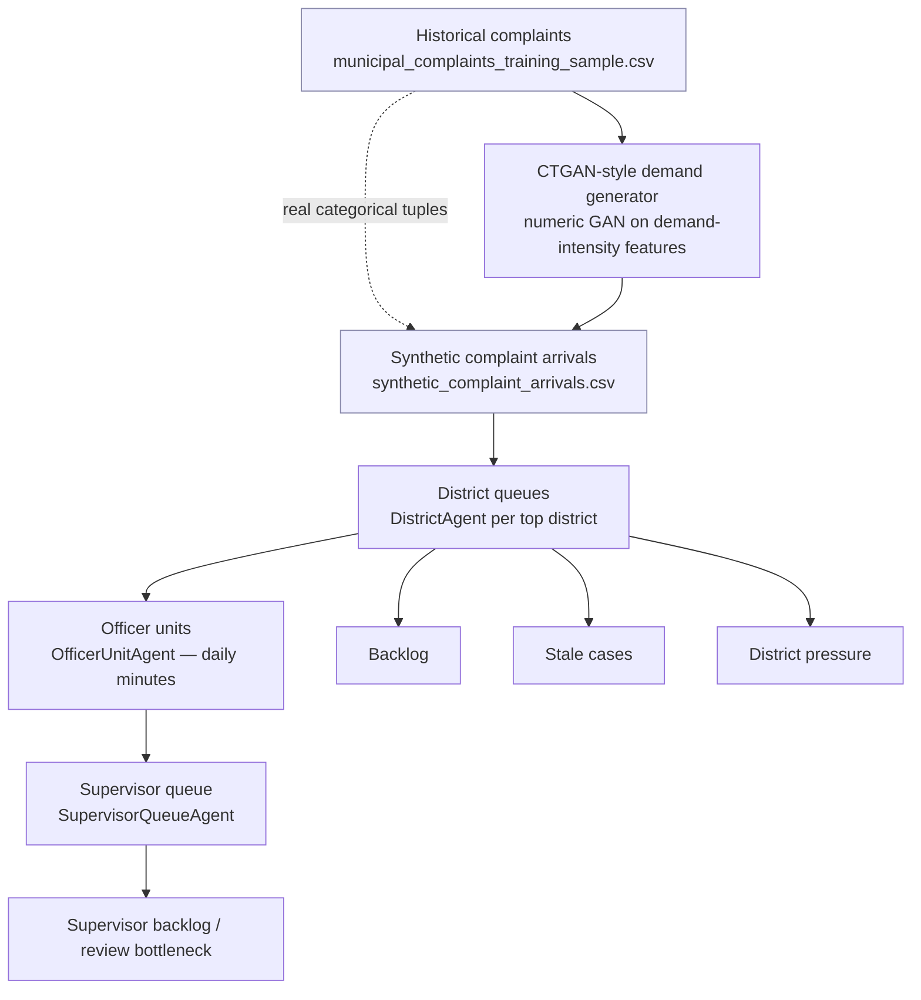

# CTGAN + ABM Stress Lab — How the Model Works

This document explains the synthetic-demand stress lab that lives in
[`scripts/ctgan_abm/run_ctgan_abm_stress_lab.py`](../scripts/ctgan_abm/run_ctgan_abm_stress_lab.py).
It turns historical municipal complaints into a **synthetic stream of future
complaint arrivals**, then runs an **agent-based model (ABM)** to see where the
backlog, stale cases, and supervisor pressure build up.

## Pipeline at a glance



### Why "CTGAN-style" and not pure CTGAN?

A small GAN cannot faithfully reproduce ~150 complaint types across ~50 council
districts — it mode-collapses and emits blank categories (that was the original
bug: every district came out as `Unknown` and the complaint-type table was
empty). So the lab splits the job:

- **The GAN owns the numeric demand signal.** It trains on the engineered
  numeric features (`patrol_intensity_score`, `repeat_pressure_score`, temporal
  fields, supervisor-likelihood) and generates fresh demand-intensity vectors.
- **Real categoricals are bootstrapped.** Each synthetic arrival borrows a real
  `(council_district, borough, complaint_type, request_detail, closure_bucket)`
  tuple sampled from the empirical joint distribution of the training data.

The result: synthetic arrivals always carry **credible, real-world categories**
while the *pressure* attached to each arrival comes from the generative model.

### Categorical mapping rules

| Field | Source | Fallback | Last resort |
|-------|--------|----------|-------------|
| `district` | `council_district` | `borough` | `Unknown` |
| `complaint_type` | `complaint_type` | `request_detail` | `Other` |
| `closure_bucket` | `closure_bucket` | — | `unknown` (never blank) |
| `borough` | `borough` | — | `Unknown` only if truly missing |

`district_or_area` in the output is the readable label derived from the council
district (e.g. council district `34` → `Council District 34`).

## The agents

### `ComplaintAgent`
One synthetic service request. Carries its district, borough, complaint type, and
three demand scores (`priority`, `closure_pressure`, `patrol_intensity`), a
`supervisor_review_required` flag, an `age_days` counter, and a `status`
(`open → processed → closed`). It ages by one day for every day it sits unworked
in a queue.

### `OfficerUnitAgent`
One enforcement unit inside a district. Its **daily minutes (~390, i.e. 6.5h) are
the depleted resource** of the whole model. Working a case consumes minutes
(30–240 depending on the case's patrol-intensity). When a unit runs out of
minutes it can take no more cases that day; minutes reset the next morning. There
are several units per district (default 4).

### `DistrictAgent`
One district, **keyed by the mapped `district` value**. It owns its officer units
and its own FIFO/priority queue. Each day it:
1. accepts new arrivals (`total_cases` counts everything ever routed to it),
2. works the queue against available officer minutes (highest priority, then
   oldest first),
3. recomputes `backlog` (queue still unworked), `stale_cases` (waiting
   ≥ 14 days), and an `overload_flag`.
Cases that need a second look are handed to the supervisor queue.

### `SupervisorQueueAgent`
The review bottleneck. Officer-processed cases flagged for review land here and
are closed at a fixed rate — **up to `supervisor_daily_review_capacity` (75) per
day**, stale-first. When the daily inflow of review cases exceeds capacity, this
queue grows and becomes a visible bottleneck (the `supervisor_queue_size` daily
metric).

## Supervisor-review triggers

A complaint requires supervisor review when **any** of the following hold:

- `closure_bucket` indicates a long resolution (30–90 days, 90+ days — mapped to
  the source `30_plus_days` bucket),
- `patrol_intensity_score >= 0.65`,
- `closure_pressure_score >= 0.70`.

`closure_pressure_score` is derived deterministically from the closure bucket
(`same_day → 0.10`, `1_7_days → 0.35`, `8_30_days → 0.60`, `30_plus_days → 0.85`).

## The depleted resource

The single scarce resource is **officer daily minutes**. Everything the lab
reports — backlog growth, stale cases, district pressure, and the supervisor
bottleneck — is a downstream consequence of arrivals outpacing the finite pool of
officer minutes available each day.

## Validation gates

The run fails loudly (non-zero exit) if the output is not credible:

- more than **5%** of generated arrivals have an `Unknown` district,
- `complaint_type_metrics` has **0 rows**,
- `district_metrics` has **0 rows**.

It also prints the distinct district count, distinct complaint-type count,
supervisor queue min/max/avg, and the Unknown-district percentage on every run.

## Preparing training samples

The 100k sample ships via
[`scripts/ctgan_abm/prepare_training_sample.py`](../scripts/ctgan_abm/prepare_training_sample.py)
(reads the processed NYC 311 file already in the repo).

For larger runs, use the chunked reservoir sampler
[`scripts/ctgan_abm/prepare_training_sample_large.py`](../scripts/ctgan_abm/prepare_training_sample_large.py).
The big source CSV lives **outside the repo** and is machine-specific, so `--in`
is **required** — no path is baked into the script. Generated samples are
git-ignored (`data/ctgan_abm/*.csv`). Example:

```bash
python scripts/ctgan_abm/prepare_training_sample_large.py \
    --in "C:/path/to/nyc311_1year_cleaned.csv" --sample-size 500000
# -> data/ctgan_abm/municipal_complaints_training_sample_500k.csv

python scripts/ctgan_abm/run_ctgan_abm_stress_lab.py \
    --input data/ctgan_abm/municipal_complaints_training_sample_500k.csv \
    --output outputs/ctgan_abm_500k \
    --days 30 --scenarios 25 --synthetic-rows 50000 \
    --top-districts 50 --epochs 50 --batch-size 1024
```

## Database schema & loading (migrations 033 → 034)

- **Migration `033`** introduced the initial CTGAN ABM tables and views (uuid ids,
  a minimal column set).
- **Migration `034`** aligns the database schema with the *actual* generated ABM
  output CSVs: it switches ids to **text** (the run uses human-readable ids such
  as `scenario_000` and `run_000_20260624_020547`) and adds the full metric
  columns (`processed`, `backlog`, `stale_cases`, `supervisor_queue_size`,
  `overload_flag`, `processed_cases`, `closed_cases`, `final_backlog`). Because no
  ABM data has been loaded yet, `034` safely drops and recreates only the
  `ctgan_abm_*` views and tables — it does **not** touch `municipal_service_requests`
  or any other table.

These ABM outputs are **planning signals, not enforcement decisions** — they
describe where synthetic demand would pressure queues under stress, to inform
staffing and review-capacity planning. They do not direct action against any
individual case or location.

Loading into Supabase is a **separate, manual step performed after review** (it
is never part of the model run). Use the client-side loader
[`scripts/ctgan_abm/load_ctgan_abm_500k.sql`](../scripts/ctgan_abm/load_ctgan_abm_500k.sql)
once migrations `033` and `034` are applied:

```bash
psql "$SUPABASE_DB_URL" -v ON_ERROR_STOP=1 -f scripts/ctgan_abm/load_ctgan_abm_500k.sql
```

It uses `\copy` (client-side) so it works against hosted Supabase, lists columns
explicitly per table, and loads the 5 metric CSVs only —
`synthetic_complaint_arrivals.csv` is not loaded (no destination table).

## Outputs (`outputs/ctgan_abm/`)

| File | Contents |
|------|----------|
| `synthetic_complaint_arrivals.csv` | the generated arrival stream (categoricals + scores) |
| `ctgan_abm_daily_metrics.csv` | per-day total/backlog/stale/supervisor-queue |
| `ctgan_abm_district_metrics.csv` | per-district totals, backlog, stale, overload |
| `ctgan_abm_complaint_type_metrics.csv` | per-complaint-type volume and hours |
| `ctgan_abm_scenarios.csv` / `_scenario_runs.csv` | scenario + run metadata |
| `load_ctgan_abm_results.sql` | COPY loader for the Supabase tables |
